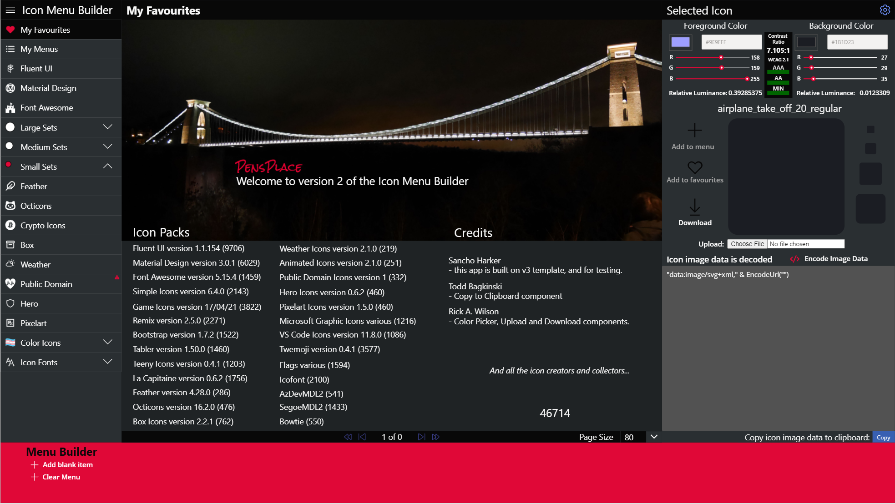

# Icon Menu Builder for Power Apps

The Icon Menu Builder is a Power Apps Maker tool designed to help accelerate app development and to ensure accessibility of theme color contrasts.  The app outputs a Power fx collection that can be used in many ways, examples are shown on the 'Menu Builder' screen.

>Your ultimate Icon resource for Power Apps

!!! information "Mimumum path to awesome"
    Check out the new documentation site [Installation Guide](https://pensplace.github.io/icon-menu-builder-docs/installation/)

## Features
- Create Menu Icon Collections for the Components and gallery examples included in the solution
- Copy Image data and Collection code to the clipboard, using [Todd Baginski](https://github.com/TBag/power-apps-copy-text-to-clipboard) PCFCopyTextComponent.
- Over 29,000 icons included, with no data source required
- Color Picker from PowerApps COE
- Contrast Checker for WCAG 2.1 contrast accessibility
- Responsive - Min Res 1920x1080 - made for hi res screens
- Upload any image and get the dataurl for an Image control or add to the menu!
- Download any image as SVG file

### Icon Sets

- [Fluent UI Icons](https://github.com/microsoft/fluentui-system-icons) (6246) v1.1.116
- [Bootstrap Icons](https://github.com/twbs/icons) (1370) v1.4.1
- [Material Design](https://materialdesignicons.com) (5962)  v5.9.55
- [Feather](https://github.com/feathericons/feather) (286) v4.28.0
- [Open Iconic](https://github.com/iconic/open-iconic) (223) v1.1.1
- [Font Awesome Free](https://github.com/FortAwesome/Font-Awesome) (1612) v5.15.3
- [Simple Icons](https://github.com/simple-icons/simple-icons) (1874) v4.17.0 
- [Octicons](https://github.com/simple-icons/simple-icons) (414) v4.17.0 
- [Weather](https://github.com/simple-icons/simple-icons) (219) v4.17.0 
- [Public Domain](https://github.com/simple-icons/simple-icons) (332) v4.17.0 
- [Eva](https://github.com/simple-icons/simple-icons) (490) v4.17.0 
- [Game Icons](https://github.com/simple-icons/simple-icons) (4090) v4.17.0 
- Microsoft Product Icons (890)
- [VS Code](https://github.com/vscode-icons/vscode-icons) (1070)  - v11.3.0
- [Noto Emoji](https://github.com/googlefonts/noto-emoji) (3339) - v13.1s
- Flags - 3 types, [Square, 4x3](https://github.com/lipis/flag-icon-css) v3.5.0 and [circle](https://github.com/HatScripts/circle-flags) v2.1 (1594)
- [Super Tiny Icons](https://github.com/edent/SuperTinyIcons) (284)
- __Total:__       29,405
# Mimimum path to awesome

You will require a Power Platform environment conigured with a database and configured to allow Code Components for canvas apps. All the solutions required are in the solutions folder.

1. Import the ColorPicker_Managed.zip solution
2. Import the CopyTextSolution.zip solution
3. Import the CanvasFileUploaderComponent_managed.zip solution
4. Import the CanvasFileDownloaderControl.zip solution
5. Import the IconMenuBuilder_1_0_0_11_managed.zip

Open the solution and play the canvas app.

# Update 1.0.0.10

# Update 1.0.0.10
Bug fix to the collection output screen not showing:
# Update 1.0.0.9
Some major changes in this release:
## New Icons
- Bootstrap icons
- Feather Icons
- Iconic Icons
- 3 styles of Flag Icons
- Super Tiny Icons
- Public Domain
- Eva
- More Noto Emoji's
- Game Icons
## Features
- Removed the majority of components previously used as static datasource, now imported from Excel, reduced the file size by 10mb to approx 25mb while added 9000 more icons...
- Redesigned Menu Builder
- New Screen to view the menu in different menu styles
- Upload any image file and create PowerFx Image tag or add to the menu, users Rick Wilson's FileUploaderComponent
# Update 1.0.0.8
Added 2307 Noto Emoji's
# Update 1.0.0.7
- Renamed to 'Icon Menu Builder' as it includes more than just the Fluent UI Icons
- Download SVG files from created icons... Utilises [CanvasFileDownloaderControl](https://github.com/rwilson504/PCFControls/releases) - you will need to install this in your environment to use this new version.
- Created for large screen usage... ;)
- Updated the Collection Screen to make it clearer to read.
# Update 1.0.0.6
- Fixed wrapcount calculations on the Icons gallery so it displays correctly when the menu container is expanded
# Update 1.0.0.5

- Refactored Icon collections into output properties of a new component __PP-Icons__ for performance and making editing possible (Pushing the limits of how much data can be self contained)
- Added 5962 Material Design Icons
- Added 1075 VS Code Icons
- Add Menu add multi-colored icons to the newMenu collection
