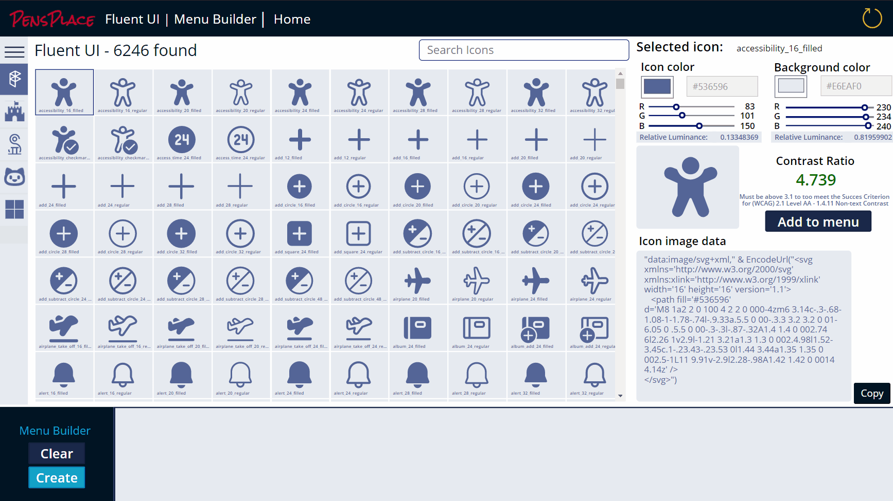

# Fluent UI Menu Builder for Power Apps

## Features
- Create Menu Icon Collections for the PP-MainMenu Component included in the solution
- Copy Image data and Collection code to the clipboard, using [Todd Baginski](https://github.com/TBag/power-apps-copy-text-to-clipboard) PCFCopyTextComponent.
- Over 11000 icons included
- Color Picker from PowerApps COE
- Contrast Checker for WCAG 2.1 non-text contrast accessibility

### Icon Sets
- [Fluent UI Icons](https://github.com/microsoft/fluentui-system-icons) (6246) v1.1.116
- [Font Awesome Free](https://github.com/FortAwesome/Font-Awesome) (1612) v5.15.3
- [Simple Icons](https://github.com/simple-icons/simple-icons) (1874) v4.17.0
- [Octicons](https://github.com/primer/octicons) (414) v12.1.0
- Microsoft Graphics (903) - Svg Microsoft Graphics 

Total 11,049 icons and images.

# Installation

You will require a Power Platform environment conigured with a database and configured to allow Code Components for canvas apps. All the solutions required are in the soltions folder.

1. Import the ColorPicker_Managed.zip solution 
2. Import the CopyTextSolution.zip solution
3. Import the FluentUIMenuGenerator_1_0_0_3.zip

Open the solution and play the canvas app.
s