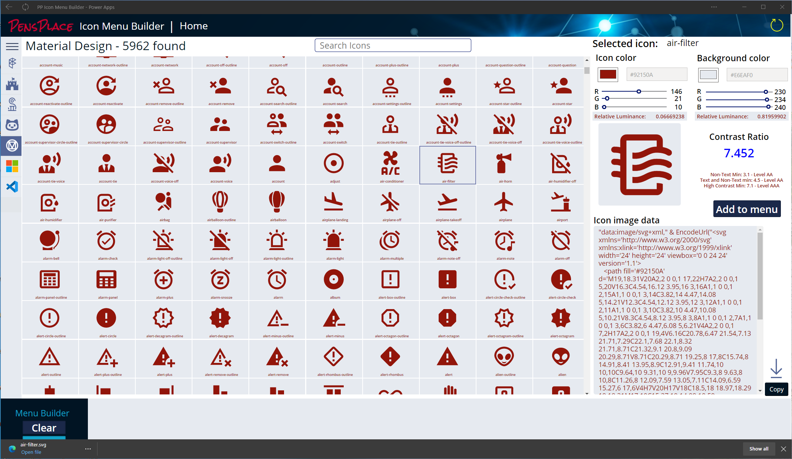
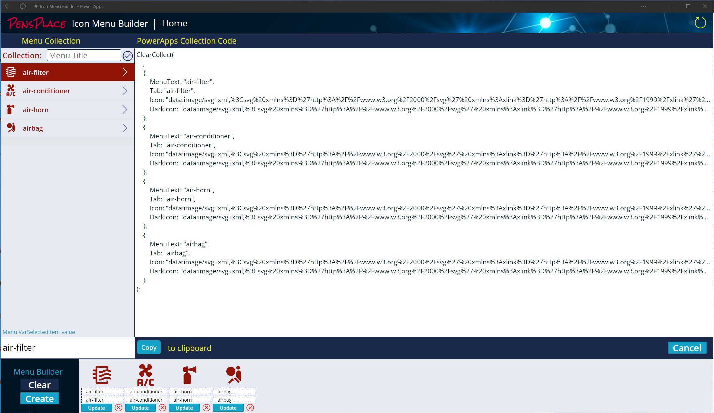
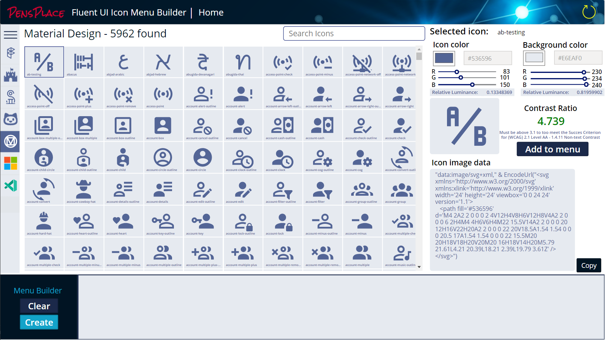
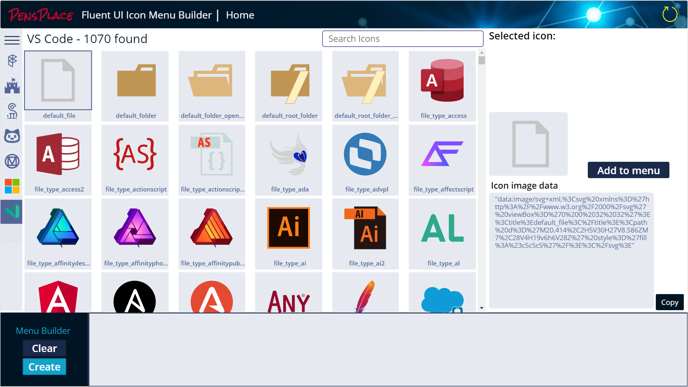
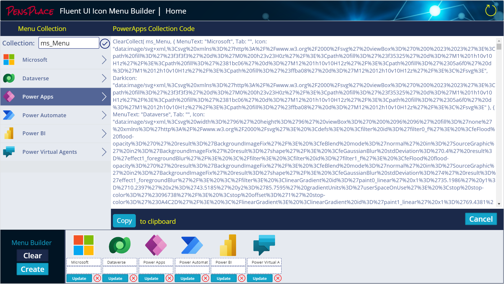

# Icon Menu Builder for Power Apps

# Update 1.0.0.7
- Renamed to 'Icon Menu Builder' as it includes more than just the Fluent UI Icons
- Download SVG files from created icons... Utilises [CanvasFileDownloaderControl](https://github.com/rwilson504/PCFControls/releases) - you will need to install this in your environment to use this new version.
- Created for large screen usage... ;)
- Updated the Collection Screen to make it clearer to read.

# Update 1.0.0.6
- Fixed wrapcount calculations on the Icons gallery so it displays correctly when the menu container is expanded
# Update 1.0.0.5

- Refactored Icon collections into output properties of a new component __PP-Icons__ for performance and making editing possible (Pushing the limits of how much data can be self contained)
- Added 5962 Material Design Icons

- Added 1075 VS Code Icons

- Add Menu add multi-colored icons to the newMenu collection

## Features
- Create Menu Icon Collections for the PP-MainMenu Component included in the solution
- Copy Image data and Collection code to the clipboard, using [Todd Baginski](https://github.com/TBag/power-apps-copy-text-to-clipboard) PCFCopyTextComponent.
- Over 11000 icons included
- Color Picker from PowerApps COE
- Contrast Checker for WCAG 2.1 non-text contrast accessibility

### Icon Sets
- [Fluent UI Icons](https://github.com/microsoft/fluentui-system-icons) (6246)  - v1.1.116
- [Font Awesome Free](https://github.com/FortAwesome/Font-Awesome) (1612)  - v5.15.3
- [Simple Icons](https://github.com/simple-icons/simple-icons) (1874)  - v4.17.0
- [Octicons](https://github.com/primer/octicons) (414) - v12.1.0
- [Material Design](https://materialdesignicons.com) (5962) - v5.9.55
- Microsoft Graphics (903) - Svg Microsoft Graphics
- [VS Code](https://github.com/vscode-icons/vscode-icons) (1070)  - v11.3.0

__Single Color Icons:__  16,108
__Multi Color Icons:__    1,969
__Total:__               18,077

# Installation

You will require a Power Platform environment conigured with a database and configured to allow Code Components for canvas apps. All the solutions required are in the soltions folder.

1. Import the ColorPicker_Managed.zip solution 
2. Import the CopyTextSolution.zip solution
3. Import the FluentUIMenuGenerator_1_0_0_5_managed.zip

Open the solution and play the canvas app.

